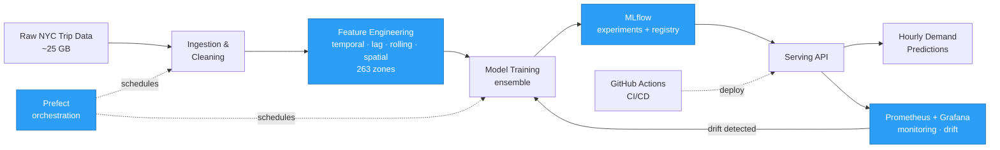
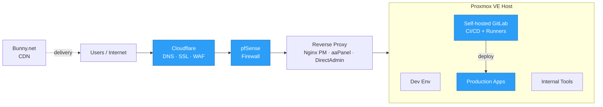

<!-- ====================== HERO BANNER ====================== -->
<div align="center">

<a href="https://github.com/nhonhoccode">
  
</a>

<!-- ====================== TYPING ANIMATION ====================== -->

[](https://git.io/typing-svg)

<!-- ====================== SOCIAL / STATUS BADGES ====================== -->
<a href="https://www.linkedin.com/in/maximus-nhon/"></a>
<a href="mailto:votrongnhonwork29324@gmail.com"></a>
<a href="https://github.com/nhonhoccode"></a>


</div>

---

## 🎯 Career Objective

> **DevOps engineer** building and operating **reliable platforms for AI, data science, data engineering & analytics**. Experienced in **CI/CD, self-hosted infrastructure, observability**, and **production operations** for ML services, data pipelines, and internal developer environments. Long term, I aim to expand into **cloud, cybersecurity, full-stack web, and foundational quantitative finance**.

---

## 📫 Contact

<table>
<tr>
<td>📧 <b>Email</b></td>
<td><a href="mailto:votrongnhonwork29324@gmail.com">votrongnhonwork29324@gmail.com</a></td>
<td>💼 <b>LinkedIn</b></td>
<td><a href="https://www.linkedin.com/in/maximus-nhon/">in/maximus-nhon</a></td>
</tr>
<tr>
<td>🐙 <b>GitHub</b></td>
<td><a href="https://github.com/nhonhoccode">@nhonhoccode</a></td>
<td>📍 <b>Location</b></td>
<td>Ho Chi Minh City, Vietnam</td>
</tr>
</table>

---

## 🚀 About Me

<table>
<tr>
<td valign="top" width="58%">

```yaml
name:           "Vo Trong Nhon"
role:           "DevOps Engineer @ BlueBolt"
based_in:       "Ho Chi Minh City, Vietnam"
field:          "B.Sc. in Data Science"
philosophy:     "Automate everything that can be automated."
```

I’m a **DevOps engineer** who loves building and running the
systems that let teams ship with confidence — from **CI/CD**
and **self-hosted infrastructure** to **MLOps**, **observability**,
and **production operations**.

I also build **AI applications** and **full-stack web products**
end-to-end, and I'm steadily exploring **quant finance,
investing, and entrepreneurship** on the side.

</td>
<td valign="top" width="42%">

<b>Focus Areas</b>

▸ &nbsp; Systems &amp; DevOps <br/>
▸ &nbsp; AI Applications <br/>
▸ &nbsp; Full-stack Web <br/>
▸ &nbsp; Quantitative Finance <br/>
▸ &nbsp; Investing &amp; Entrepreneurship <br/>

<br/>

<b>Currently</b>

▸ &nbsp; Running platforms @ BlueBolt <br/>
▸ &nbsp; Exploring Cloud &amp; Cybersecurity <br/>
▸ &nbsp; Open to collaboration

</td>
</tr>
</table>

---

## 📜 Certifications

<div align="center">

<table width="100%">
<tr>
<td align="center" width="33%">
<br/>

<br/><br/>
<b>AWS Academy</b><br/>
<sub>Cloud Foundations &amp; AI</sub>
<br/><br/>
</td>
<td align="center" width="33%">
<br/>

<br/><br/>
<b>IELTS</b><br/>
<sub>Overall Band 5.5</sub>
<br/><br/>
</td>
<td align="center" width="33%">
<br/>

<br/><br/>
<b>Always Learning</b><br/>
<sub>More certifications in progress</sub>
<br/><br/>
</td>
</tr>
</table>

<sub>🏅 <b>Competition honors:</b> 🥇 First Prize — UIT Challenge 2024 &nbsp;·&nbsp; 🥈 Top 2 — VLSP 2025 (Semantic Parsing) &nbsp;·&nbsp; 🥉 Top 6 — VLSP 2025 (Numerical Reasoning) &nbsp;·&nbsp; 🥇 1st Leaderboard — Multimodal Sarcasm UITC 2024</sub>

</div>

---

## 🛠️ Tech Stack

<div align="center">

<!-- core stack as a unified icon grid -->


<br/><br/>

<table>
<tr>
<td align="center">🏗️ <b>Platform &amp; Infra</b></td>
<td>Proxmox VE · pfSense · Nginx Proxy Manager · aaPanel · DirectAdmin · Bunny.net · DNS/SSL</td>
</tr>
<tr>
<td align="center">📊 <b>MLOps &amp; Data</b></td>
<td>MLflow · Airflow · Prefect · DuckDB · Pandas · Jupyter · SQL Server · Power BI</td>
</tr>
<tr>
<td align="center">🤖 <b>ML Toolbox</b></td>
<td>XGBoost · LightGBM · OpenCV · ViT / Transformers · Ensemble methods</td>
</tr>
</table>

</div>

---

## 📌 Featured Projects

<table>
<tr>
<td width="50%" valign="top">

### 🚕 [NYC Taxi Demand Forecasting — MLOps Platform](https://github.com/nhonhoccode/MLOps-System-for-NYC-taxi-Demand-Forecasting) ⭐
> End-to-end hourly demand forecasting across **263 NYC zones**.

- 📉 Best setup achieved **MAPE 12.3%**
- 🗄️ Processed **~25 GB** of trip data into zone-level features (temporal, lag, rolling-window, spatial)
- 🔬 Experiment & model tracking with **MLflow**
- 🔁 **Prefect** + **Prometheus/Grafana** + **GitHub Actions** CI/CD for scheduled runs, drift checks & retraining

`Python` · `MLflow` · `Prefect` · `Prometheus` · `Grafana` · `Docker`

</td>
<td width="50%" valign="top">

### 🤖 [Agentic Data Platform](https://github.com/nhonhoccode/agentic-data-platform)
> E-commerce analytics platform with a multi-agent layer.

- 🏗️ Data-engineering pipelines + serving layer
- 🕹️ **Multi-agent orchestration** for analytics workflows
- 🔌 API integration & reusable components
- 📦 Containerized, production-oriented design

`Python` · `Data Engineering` · `LLM Agents` · `Docker`

</td>
</tr>
<tr>
<td width="50%" valign="top">

### 🧠 [Fine-tuning LLMs on Domain Data (Big Data)](https://github.com/nhonhoccode/bigdata-project-finetuneLLMs-on-domain-)
> Large-scale fine-tuning of LLMs for domain-specific tasks.

- 📚 Domain-adaptation of language models
- ⚙️ Big-data preprocessing & training pipeline
- 🧪 Experiment tracking & evaluation

`Python` · `Transformers` · `PyTorch` · `Big Data`

</td>
<td width="50%" valign="top">

### 🎭 [Multimodal Sarcasm Detection — UITC 2024](https://github.com/nhonhoccode/Multimodal-Sarcasm-Detection-for-UITC2024) 🥇
> 🥇 **1st place** on the public leaderboard (Team *Faster-United*).

- 🏅 **F1-score = 44.75%**
- 🖼️ Text + image + generated captions (multimodal)
- 🔡 **VinTern-1B-v2** captioning · **ViT** + **Jina Embedding v3**
- 🗳️ 2/3/4-class classifiers (CE & Focal Loss) + voting ensemble

`Python` · `ViT` · `Transformers` · `PyTorch`

</td>
</tr>
</table>

<details>
<summary>🔬 <b>More projects</b> (VLSP 2025, RAG, ETL, and more)</summary>

<br/>

- ⚖️ **[Vietnamese Legal RAG](https://github.com/nhonhoccode/vn-legal-rag-zalo-2021)** — RAG over Vietnamese legal text with fine-tuned embeddings + hard-negative mining (FastAPI + Next.js).
- 😀 **[Facial Emotion Recognition](https://github.com/nhonhoccode/Facial-Emotion-Recognition)** — CK+ emotion classification (95% acc); HOG/SIFT vs CNN; Django demo.
- ⭐ **[ViAMR — VLSP 2025](https://github.com/nhonhoccode/ViAMR_VLSP2025)** — Vietnamese AMR / semantic parsing (🥈 Top 2 Semantic Parsing, 🥉 Top 6 Numerical Reasoning QA).
- 🛒 **[Customer Propensity to Purchase](https://github.com/nhonhoccode/Customer-propensity-to-purchase-Docker-)** — Airflow-orchestrated ETL + Dockerized batch pipeline with a prediction UI.

</details>

<div align="center">

[](https://github.com/nhonhoccode?tab=repositories)

</div>

---

## 🏗️ Architecture Highlights

<details open>
<summary><b>🚕 NYC Taxi Demand — MLOps Pipeline</b></summary>



</details>

<details>
<summary><b>🌐 Self-hosted DevOps Infrastructure</b></summary>



</details>

---

## 📈 GitHub Stats

<div align="center">


<br/>


</div>

---

## 🐍 Contribution Graph

<div align="center">

<picture>
  <source media="(prefers-color-scheme: dark)" srcset="https://raw.githubusercontent.com/nhonhoccode/nhonhoccode/output/github-contribution-grid-snake-dark.svg"/>
  <source media="(prefers-color-scheme: light)" srcset="https://raw.githubusercontent.com/nhonhoccode/nhonhoccode/output/github-contribution-grid-snake.svg"/>
  
</picture>


</div>

---

## 💼 Experience

**🔧 System Administrator / DevOps Engineer** — *BlueBolt*  ·  `10/2025 – Present`
- Operate **Proxmox VE** for developer, internal & production environments
- Manage **pfSense, Cloudflare, DNS, SSL** & reverse-proxy publishing (Nginx Proxy Manager, aaPanel, DirectAdmin)
- Built self-hosted **GitLab CI/CD** & internal automation for deployment and routine ops

**🌐 Freelance Developer** — *Remote*  ·  `07/2025 – Present`
- Built business web apps (e-commerce storefronts, internal workflow systems) end-to-end
- Managed **Docker** production rollout + domain/DNS/SSL/reverse-proxy & traffic protection

---

## 🤝 Connect With Me

<div align="center">

<a href="mailto:votrongnhonwork29324@gmail.com"></a>
<a href="https://www.linkedin.com/in/maximus-nhon/"></a>
<a href="https://github.com/nhonhoccode"></a>

<br/><br/>


<i>⭐️ Thanks for visiting — let's build reliable systems together.</i>

</div>
