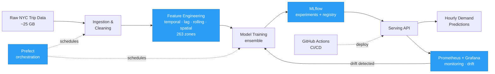
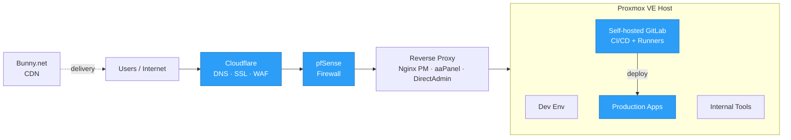

<!-- ============================================================ -->
<!--  Vo Trong Nhon — GitHub Profile README                       -->
<!--  Icons: local SVG (assets/icons) · skillicons.dev · shields  -->
<!-- ============================================================ -->

<!-- ====================== HERO BANNER ====================== -->
<div align="center">

<a href="https://github.com/nhonhoccode">
  
</a>

<!-- ====================== TYPING ANIMATION ====================== -->

[](https://git.io/typing-svg)

<!-- ====================== SOCIAL / STATUS BADGES ====================== -->
<a href="https://www.linkedin.com/in/maximus-nhon/"></a>
<a href="https://www.facebook.com/maximus.vtn.293.nhondangcode.Ops"></a>
<a href="mailto:votrongnhonwork29324@gmail.com"></a>
<a href="https://github.com/nhonhoccode"></a>


</div>

---

##  Career Objective

> I design, ship, and operate the infrastructure that turns models and ideas into **dependable production systems**. My work spans **CI/CD automation, self-hosted infrastructure, MLOps, and end-to-end observability** — keeping ML services, data pipelines, and developer environments fast, reliable, and reproducible.
>
> I move comfortably across the stack: **DevOps & platform engineering**, **AI/ML engineering**, and **full-stack web** — from the first commit to a monitored, deployed release. Beyond engineering, I'm driven by a long-term curiosity for **cloud & cybersecurity, quantitative finance, investing, and entrepreneurship**, and I'm always looking for hard problems where reliable systems create real leverage.

---

##  About Me

<table>
<tr>
<td valign="top" width="58%">

```yaml
name:        "Vo Trong Nhon"
role:        "DevOps Engineer"
based_in:    "Ho Chi Minh City, Vietnam"
field:       "B.Sc. in Data Science"
philosophy:  "Automate everything that can be automated."
```

I'm a **DevOps engineer** who loves building and running the
systems that let teams ship with confidence — from **CI/CD**
and **self-hosted infrastructure** to **MLOps**, **observability**,
and **production operations**.

I also build **AI applications** and **full-stack web products**
end-to-end, and I'm steadily exploring **quant finance,
investing, and entrepreneurship** on the side.

</td>
<td valign="top" width="42%">

<b>Focus Areas</b>

 &nbsp; Systems &amp; DevOps <br/>
 &nbsp; AI Applications <br/>
 &nbsp; Full-stack Web <br/>
 &nbsp; Quantitative Finance <br/>
 &nbsp; Investing &amp; Entrepreneurship <br/>

<br/>

<b>Currently</b>

 &nbsp; Running production platforms <br/>
 &nbsp; Exploring Cloud &amp; Cybersecurity <br/>
 &nbsp; Open to collaboration

</td>
</tr>
</table>

---

##  Contact

<table width="100%">
<tr>
<td width="16%"><b>Email</b></td>
<td width="34%"><a href="mailto:votrongnhonwork29324@gmail.com">votrongnhonwork29324@gmail.com</a></td>
<td width="16%"><b>LinkedIn</b></td>
<td width="34%"><a href="https://www.linkedin.com/in/maximus-nhon/">in/maximus-nhon</a></td>
</tr>
<tr>
<td><b>GitHub</b></td>
<td><a href="https://github.com/nhonhoccode">@nhonhoccode</a></td>
<td><b>Facebook</b></td>
<td><a href="https://www.facebook.com/maximus.vtn.293.nhondangcode.Ops">maximus.vtn</a></td>
</tr>
<tr>
<td><b>Location</b></td>
<td>Ho Chi Minh City, Vietnam</td>
<td><b>Open to</b></td>
<td>DevOps · MLOps · Full-stack roles</td>
</tr>
</table>

---

##  Certifications

<div align="center">

<table width="100%">
<tr>
<td align="center" width="33%">
<br/>

<br/><br/>
<b>AWS Academy</b><br/>
<sub>Cloud Foundations &amp; AI</sub>
<br/><br/>
</td>
<td align="center" width="33%">
<br/>

<br/><br/>
<b>IELTS</b><br/>
<sub>Overall Band 5.5</sub>
<br/><br/>
</td>
<td align="center" width="33%">
<br/>

<br/><br/>
<b>Always Learning</b><br/>
<sub>More certifications in progress</sub>
<br/><br/>
</td>
</tr>
</table>

<b> Competition Honors</b>

<p>


&nbsp;


</p>
<p>


&nbsp;


</p>

</div>

---

##  Tech Stack

<div align="center">


</div>

<table width="100%">
<tr>
<td width="22%" valign="middle"> <b>Platform &amp; Infra</b></td>
<td>Proxmox VE · pfSense · Nginx Proxy Manager · aaPanel · DirectAdmin · Bunny.net · DNS / SSL · Reverse proxy</td>
</tr>
<tr>
<td valign="middle"> <b>MLOps &amp; Data</b></td>
<td>MLflow · Airflow · Prefect · DuckDB · DBeaver · Pandas · Jupyter · SQL Server · Power BI</td>
</tr>
<tr>
<td valign="middle"> <b>ML Toolbox</b></td>
<td>XGBoost · LightGBM · OpenCV · ViT / Transformers · Ensemble methods</td>
</tr>
</table>

---

##  Featured Projects

<table>
<tr>
<td width="50%" valign="top">

####  [NYC Taxi Demand Forecasting — MLOps Platform](https://github.com/nhonhoccode/MLOps-System-for-NYC-taxi-Demand-Forecasting)
> End-to-end hourly demand forecasting across **263 NYC zones**.

- Best setup achieved **MAPE 12.3%**
- Processed **~25 GB** of trip data into zone-level features (temporal, lag, rolling-window, spatial)
- Experiment & model tracking with **MLflow**
- **Prefect** + **Prometheus/Grafana** + **GitHub Actions** CI/CD for scheduled runs, drift checks & retraining

`Python` · `MLflow` · `Prefect` · `Prometheus` · `Grafana` · `Docker`

</td>
<td width="50%" valign="top">

####  [Agentic Data Platform](https://github.com/nhonhoccode/agentic-data-platform)
> E-commerce analytics platform with a multi-agent layer.

- Data-engineering pipelines + serving layer
- **Multi-agent orchestration** for analytics workflows
- API integration & reusable components
- Containerized, production-oriented design

`Python` · `Data Engineering` · `LLM Agents` · `Docker`

</td>
</tr>
<tr>
<td width="50%" valign="top">

####  [Fine-tuning LLMs on Domain Data (Big Data)](https://github.com/nhonhoccode/bigdata-project-finetuneLLMs-on-domain-)
> Large-scale fine-tuning of LLMs for domain-specific tasks.

- Domain-adaptation of language models
- Big-data preprocessing & training pipeline
- Experiment tracking & evaluation

`Python` · `Transformers` · `PyTorch` · `Big Data`

</td>
<td width="50%" valign="top">

####  [Multimodal Sarcasm Detection — UITC 2024](https://github.com/nhonhoccode/Multimodal-Sarcasm-Detection-for-UITC2024)
> **1st place** on the public leaderboard (Team *Faster-United*).

- **F1-score = 44.75%**
- Text + image + generated captions (multimodal)
- **VinTern-1B-v2** captioning · **ViT** + **Jina Embedding v3**
- 2/3/4-class classifiers (CE & Focal Loss) + voting ensemble

`Python` · `ViT` · `Transformers` · `PyTorch`

</td>
</tr>
<tr>
<td width="50%" valign="top">

####  [Vietnamese Legal RAG](https://github.com/nhonhoccode/vn-legal-rag-zalo-2021)
> Retrieval-Augmented Generation over Vietnamese legal text.

- Fine-tuned sentence embeddings + **hard-negative mining**
- Retrieval over legal corpora
- RAG pipeline with **FastAPI + Next.js** front-end

`Python` · `RAG` · `Embeddings` · `FastAPI`

</td>
<td width="50%" valign="top">

####  [Facial Emotion Recognition](https://github.com/nhonhoccode/Facial-Emotion-Recognition)
> Emotion classification on **CK+** with a deployable demo.

- Best experiment reached **95% accuracy**
- Compared **HOG / SIFT** vs **CNN** models
- Inference wrapped in a **Django** web app

`Python` · `TensorFlow` · `OpenCV` · `Django`

</td>
</tr>
</table>

<details>
<summary><b>More projects</b> (VLSP 2025, ETL, and more)</summary>

<br/>

- **[ViAMR — VLSP 2025](https://github.com/nhonhoccode/ViAMR_VLSP2025)** — Vietnamese AMR / semantic parsing (Top 2 Semantic Parsing, Top 6 Numerical Reasoning QA).
- **[Customer Propensity to Purchase](https://github.com/nhonhoccode/Customer-propensity-to-purchase-Docker-)** — Airflow-orchestrated ETL + Dockerized batch pipeline with a prediction UI.
- **[Intro to Data Science Project](https://github.com/nhonhoccode/IntroDataScience_Project)** — end-to-end data science coursework project.

</details>

<div align="center">

[](https://github.com/nhonhoccode?tab=repositories)

</div>

---

##  Architecture Highlights

<details open>
<summary><b>NYC Taxi Demand — MLOps Pipeline</b></summary>



</details>

<details>
<summary><b>Self-hosted DevOps Infrastructure</b></summary>



</details>

---

##  Experience

#### System Administrator / DevOps Engineer &nbsp;·&nbsp; `10/2025 – Present`
- Operate **Proxmox VE** for developer, internal & production environments
- Manage **pfSense, Cloudflare, DNS, SSL** & reverse-proxy publishing (Nginx Proxy Manager, aaPanel, DirectAdmin)
- Built self-hosted **GitLab CI/CD** & internal automation for deployment and routine ops
- Resolved server, networking & runtime issues to improve uptime

#### Freelance Developer &nbsp;·&nbsp; `07/2025 – Present` &nbsp;·&nbsp; Remote
- Built business web apps (e-commerce storefronts, internal workflow systems) end-to-end
- Managed **Docker** production rollout + domain / DNS / SSL / reverse-proxy & traffic protection

---

##  GitHub Stats

<div align="center">


<br/>


</div>

---

##  Contribution Graph

<div align="center">

<picture>
  <source media="(prefers-color-scheme: dark)" srcset="https://raw.githubusercontent.com/nhonhoccode/nhonhoccode/output/github-contribution-grid-snake-dark.svg"/>
  <source media="(prefers-color-scheme: light)" srcset="https://raw.githubusercontent.com/nhonhoccode/nhonhoccode/output/github-contribution-grid-snake.svg"/>
  
</picture>


</div>

---

##  Connect With Me

<div align="center">

<a href="mailto:votrongnhonwork29324@gmail.com"></a>
<a href="https://www.linkedin.com/in/maximus-nhon/"></a>
<a href="https://www.facebook.com/maximus.vtn.293.nhondangcode.Ops"></a>
<a href="https://github.com/nhonhoccode"></a>

<br/><br/>


<i>Thanks for visiting — let's build reliable systems together.</i>

</div>
